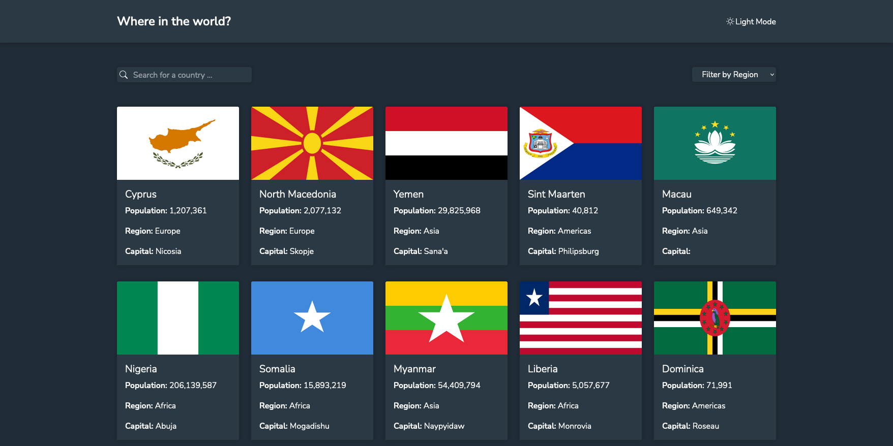
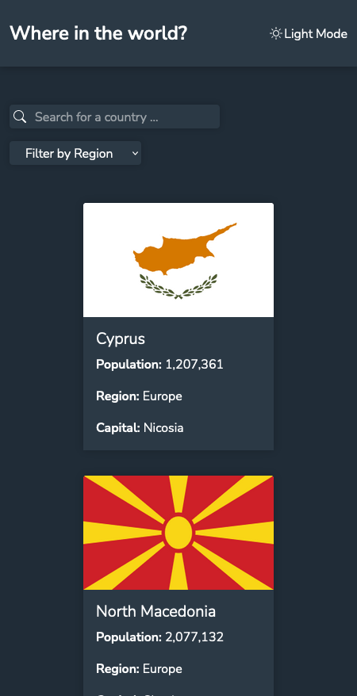
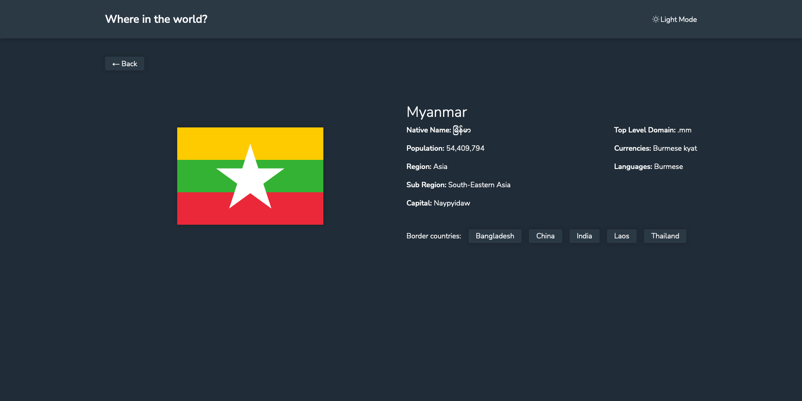
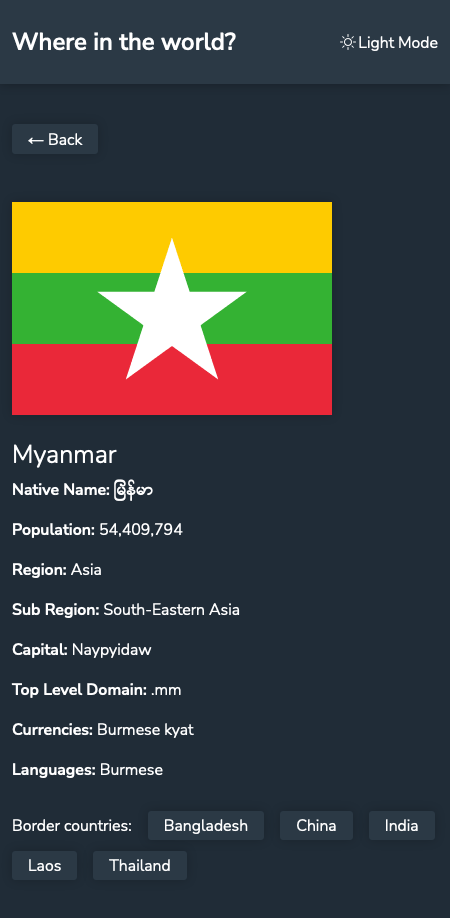

# Frontend Mentor - REST Countries API with color theme switcher solution

This is a solution to the [REST Countries API with color theme switcher challenge on Frontend Mentor](https://www.frontendmentor.io/challenges/rest-countries-api-with-color-theme-switcher-5cacc469fec04111f7b848ca). Frontend Mentor challenges help you improve your coding skills by building realistic projects.

## Table of contents

-   [Overview](#overview)
    -   [The challenge](#the-challenge)
    -   [Screenshot](#screenshot)
    -   [Links](#links)
-   [My process](#my-process)
    -   [Built with](#built-with)
    -   [What I learned](#what-i-learned)
    -   [Useful resources](#useful-resources)
-   [Author](#author)

## Overview

### The challenge

Users should be able to:

-   See all countries from the API on the homepage
-   Search for a country using an `input` field
-   Filter countries by region
-   Click on a country to see more detailed information on a separate page
-   Click through to the border countries on the detail page
-   Toggle the color scheme between light and dark mode _(optional)_

### Screenshot






### Links

-   [GitHub repo](https://github.com/darryncodes/rest-countries-api)
-   [Live URL](https://darryncodes.github.io/rest-countries-api/)

## My process

### Built with

-   Mobile-first workflow
-   Semantic HTML5 markup
-   Flexbox
-   CSS / SCSS
-   Create React App
-   [React](https://reactjs.org/) - JS library
-   [React Router](https://v5.reactrouter.com/web/guides/quick-start)
-   [React - Bootstrap](https://react-bootstrap.netlify.app/)
-   [React Icons](https://react-icons.github.io/react-icons/)

### What I learned

One huge aha moment was learning about Object.keys(). This enabled me to access data from the api call dynamically.

```js
const nativeName = countryInfo.name.nativeName;
const nameType = Object.keys(nativeName);

<span>{nativeName[nameType[0]].common}</span>;
```

### Useful resources

-   [MDN - Array.prototype.map()](https://developer.mozilla.org/en-US/docs/Web/JavaScript/Reference/Global_Objects/Array/map)
-   [MDN - Array.prototype.filter()](https://developer.mozilla.org/en-US/docs/Web/JavaScript/Reference/Global_Objects/Array/filter)
-   [MDN - Array.prototype.find()](https://developer.mozilla.org/en-US/docs/Web/JavaScript/Reference/Global_Objects/Array/find)
-   [MDN - Object.keys()](https://developer.mozilla.org/en-US/docs/Web/JavaScript/Reference/Global_Objects/Object/keys)
-   [MDN - decodeURI()](https://developer.mozilla.org/en-US/docs/Web/JavaScript/Reference/Global_Objects/decodeURI)
-   [Pure CSS Loaders](https://loading.io/css/)

## Author

-   Work in progress portfolio site - [@darryncodes](https://www.darryncodes.co.uk/)
-   Frontend Mentor - [@darryncodes](https://www.frontendmentor.io/profile/darryncodes)
-   Twitter - [@darryncodes](https://twitter.com/darryncodes)
